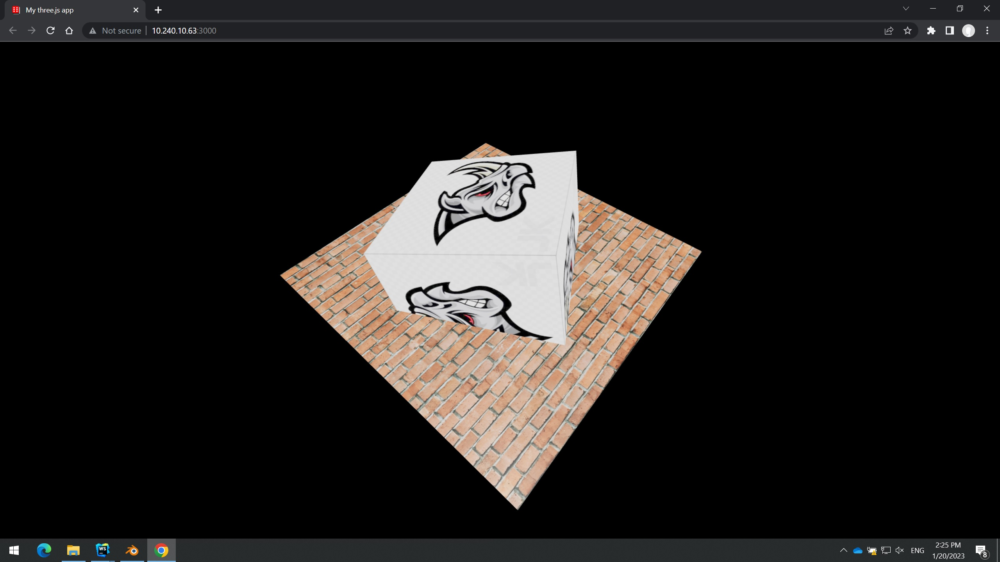

# three-jsm
Simple project example using the ES6 modules of three.js.

---

After downloading the repository, execute `npm install` once in the root directory to install all dependencies.

You can then start a local server either by 
 
- using `npm start` and open `http://localhost:3000/` for testing using the **serve** module.

or 

- using `http-server -p 3000` and open `http://localhost:3000/` for deploying.

Result should be like this. The plane is loaded with GLTFLoader. 

